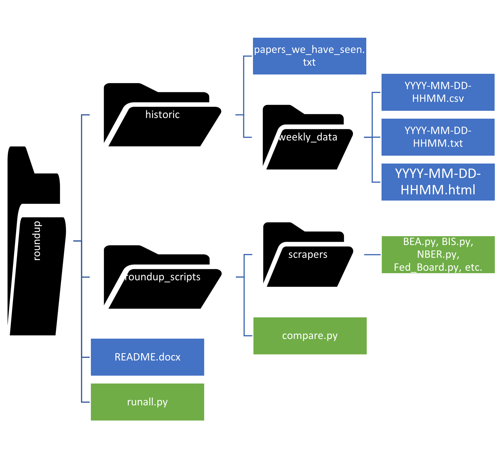

# The website is active!

View it here: https://roundup.streamlit.app/

# About

The purpose of this project is regularly track and present the most recent working papers in economics. ('Working papers', also known as 'pre-print' papers, present academic research that has not yet been peer-reviewed.) This provides insight into what topics are currently being studied in economics. This website may be of use for those interested in understanding the most recent active areas of economics research, such as economists, policy-oriented researchers, and students. As of February 2024, the project incorporates data from 20 different sources.

# How it works

The scripts in this project gather six pieces of information on the most recent working papers:
- Title
- Authors
- Abstract
- Date published (If it was posted and re-posted, the most recent date of publication is used.)
- URL
- Paper number (according to each website's own numbering system)

The primary script used in this project is `runall.py`. It cycles through a variety of Python scripts that are each catered to one individual website, such as the National Bureau of Economic Research or the International Monetary Fund. The number of scripts in this project is constantly expanding.

# Data sources
Websites that are scraped for data, as of February 2024, are:

| Name of website                                                  | Name of script                          | Scraping method |
|------------------------------------------------------------------|-----------------------------------------|-----------------|
| [Bureau of Economic Analysis](https://www.bea.gov/research/papers)                                      | roundup_scripts/scrapers/BEA.py         | Scrapes main landing page and each individual WP's landing page using Requests and BeautifulSoup           |
| [Becker Friedman Institute](https://www.bea.gov/research/papers) (at the University of Chicago)       | roundup_scripts/scrapers/BFI.py         | Scrapes main landing page and each individual WP's landing page using Requests and BeautifulSoup         |
| [Bank for International Settlements](https://www.bis.org/doclist/wppubls.rss?from=&till=&objid=wppubls&page=&paging_length=10&sort_list=date_desc&theme=wppubls&ml=false&mlurl=&emptylisttext=)                                | roundup_scripts/scrapers/BIS.py         | Scrapes RSS feed using Feedparser     |
| [Bank of England](https://www.bankofengland.co.uk/rss/publications)                                                  | roundup_scripts/scrapers/BOE.py         | Scrapes RSS feed using Feedparser and each individual WP's landing page using Requests and BeautifulSoup           |
| [European Central Bank](https://www.ecb.europa.eu/pub/research/working-papers/html/index.en.html)                                            | roundup_scripts/scrapers/ECB.py         | Scrapes and parses main landing page using Selenium and BeautifulSoup          |
| [Federal Reserve Bank of Atlanta](https://www.atlantafed.org/rss/wps)                                 | roundup_scripts/scrapers/Fed_Atlanta.py     | Scrapes RSS feed using Feedparser             |
| [Federal Reserve Board of Governors](https://www.federalreserve.gov/econres/feds/index.htm) (of the United States): working papers | roundup_scripts/scrapers/Fed_Board.py       | Scrapes main landing page using Requests and BeautifulSoup             |
| [Federal Reserve Board of Governors](https://www.federalreserve.gov/econres/notes/feds-notes/default.htm) (of the United States): Fed Notes | roundup_scripts/scrapers/Fed_Board_Notes.py       | Scrapes main landing page using Requests and BeautifulSoup             |
| [Federal Reserve Bank of Boston](https://www.bostonfed.org/publications/research-department-working-paper/)                               | roundup_scripts/scrapers/Fed_Boston.py     | Reads main landing page using Selenium and parses with BeautifulSoup. Extracts data from each individual WP's landing page using Requests and BeautifulSoup and reads PDF metadata using PyPDF2 and io       |
| [Federal Reserve Bank of Chicago](https://www.chicagofed.org/publications/publication-listing?filter_series=18)                                | roundup_scripts/scrapers/Fed_Chicago.py     | Scrapes main landing page and each individual WP's landing page using Requests and BeautifulSoup            |
| [Federal Reserve Bank of Cleveland](https://www.clevelandfed.org/publications/working-paper)                                 | roundup_scripts/scrapers/Fed_Cleveland.py     | Scrapes and parses main landing page using Selenium and BeautifulSoup.   |
| [Federal Reserve Bank of Dallas](https://www.dallasfed.org/research/papers)                                 | roundup_scripts/scrapers/Fed_Dallas.py     | Scrapes main landing page using requests and BeautifulSoup and also reads data from PDFs using PyPDF and io     |
| [Federal Reserve Bank of Kansas City](https://www.kansascityfed.org/research/research-working-papers/)                                 | roundup_scripts/scrapers/Fed_KansasCity.py     | Uses requests to acccess Kansas City Fed's API for JSON-formatted data on recent publications.     |
| [Federal Reserve Bank of New York](https://www.newyorkfed.org/research/staff_reports/index.html)                                 | roundup_scripts/scrapers/Fed_NewYork.py     | Uses requests to access New York Fed API for JSON-formatted data on recent publications. Scrapes each individual WP's landing page using requests and BeautifulSoup            |
| [Federal Reserve Bank of Philadelphia](https://www.philadelphiafed.org/search-results/all-work?searchtype=working-papers)                               | roundup_scripts/scrapers/Fed_Philadelphia.py     | Reads main landing page using Selenium and parses with BeautifulSoup. Extracts data from each individual WP's landing page using Requests and BeautifulSoup and reads PDF metadata using PyPDF2 and io       |
| [Federal Reserve Bank of Richmond](https://www.richmondfed.org/publications/research/working_papers)                               | roundup_scripts/scrapers/Fed_Richmond.py     | Reads main landing page using Selenium and parses with BeautifulSoup. Extracts data from each individual WP's landing page using Requests and BeautifulSoup and reads PDF metadata using PyPDF2 and io       |
| [Federal Reserve Bank of San Francisco](https://www.frbsf.org/economic-research/publications/working-papers/)                                | roundup_scripts/scrapers/Fed_SanFrancisco.py     | Parses and scrapes main landing page using requests_html and BeautifulSoup.   |
| [Federal Reserve Bank of St. Louis](https://research.stlouisfed.org/wp)                                | roundup_scripts/scrapers/Fed_StLouis.py     | Scrapes main landing page using Requests and BeautifulSoup.   |
| [International Monetary Fund](https://www.imf.org/en/Publications/RSS?language=eng&series=IMF%20Working%20Papers)                                      | roundup_scripts/scrapers/IMF.py         | Scrapes RSS feed using Feedparser. Scrapes each individual WP's landing page using Requests and BeautifulSoup            |
| [National Bureau of Economic Research](https://www.nber.org/api/v1/working_page_listing/contentType/working_paper/_/_/search?page=1&perPage=100)                             | roundup_scripts/scrapers/NBER.py        | Interacts with NBER API and uses requests to parse the results  |

# Getting Started
See below for instructions on how to run the project for the first time and any subsequent time.

### If running for the first time:

1. **Clone the repository:** 
  
    `git clone https://github.com/lorae/roundup`

2. **Set your working directory into the repository:**

   `cd ~/roundup`

3. **Create a [virtual environment](https://docs.python.org/3/library/venv.html):** 

   `python -m venv .venv`

4. **[Source](https://docs.python.org/3/library/venv.html#how-venvs-work) the virtual environment:**

    - **Using bash/zsh:**

        `source .venv/bin/activate`

    - **Using Windows PowerShell:**

         `.venv/Scripts/activate`

5. **Install dependencies**

    `python -m pip install -r requirements.txt`

6. **Start the script**

    `python runall.py`

7. **View results:**

    Navigate to [https://roundup.streamlit.app](https://roundup.streamlit.app/). Dashboard will automatically update with your results after a commit. Sometimes, it takes as long as 5 minutes to update. Alternatively, open in 'historic/weekly_data/YYYY-MM-DD-HHMM.html'. "YYYY-MM-DD-HHMM" will be populated with the day, hour and minute that you ran the code.

### If running again:
1. **Set your working directory into the repository:**

   `cd ~/roundup`

2. **[Source](https://docs.python.org/3/library/venv.html#how-venvs-work) the virtual environment:**

    - **Using bash/zsh:**

        `source .venv/bin/activate`

    - **Using Windows PowerShell:**

         `.venv/Scripts/activate`
3. **Start the script**

    `python runall.py`

4. **View results:**

   Navigate to [https://roundup.streamlit.app](https://roundup.streamlit.app/). Dashboard will automatically update with your results after a commit. Sometimes, it takes as long as 5 minutes to update.
   Alternatively, view results in `historic/weekly_data/YYYY-MM-DD-HHMM.html`. "YYYY-MM-DD-HHMM" will be populated with the day, hour and minute that you ran the code.

# Project Structure
The schematic below illustrates the basic file structure of the project. 

**roundup**

The project directory.

- **runall.py**:  
  The main script in this project. It loops through each of the scripts in `roundup_scripts/scrapers/XXX.py`, first checking against `scraper_status.txt` to check if any of the scrapers are turned off. If they are, it skips executing the scraper. If the scraper is on, then it will attempt to run it (if there is an error during script execution, then it will turn the scraper off for future runs). Running each scraper script means gathering a data frame of all of the new data available from each website. Then it invokes the `compare_historic(df)` function from `roundup_scripts/compare.py` to see which of the working papers have already been seen, and which are truly novel. `compare_historic(df)` uses data from `papers_we_have_seen.txt` to make this determination. Once `compare_historic(df)` has been successfully executed, new date- and time- stamped files are saved as `historic/weekly_data/YYYY-MM-DD-HHMM.csv`, `historic/weekly_data/YYYY-MM-DD-HHMM.txt`, and `historic/weekly_data/YYYY-MM-DD-HHMM.html` which contain metadata (title, authors, abstract, URL, date published, paper number, and unique paper ID number) on only the working papers that have not previously been scraped by runall.py.

- **README.md**:  
  The document you are currently reading.

- **requirements.txt**:  
  The necessary file to get your venv set up on this project.

- **scraper_status.txt**:  
  A file that lists whether each scraper is turned on or off. If a scraper is turned off, `runall.py` will not attempt to run it. `runall.py` also writes to this file, and switches scrapers off when it encounters an error trying to run them. 
  The purpose of this file is to enable the code to run, even if a few of the scrapers are broken. The changing nature of the websites means that even the most well-coded web scrapers will fail eventually.

- **historic**:  
  A folder containing data that has been previously scraped in this project.

    - **papers_we_have_seen.txt**:  
  A file that can be considered the main historical record of the project. It tells `compare.py` which papers we have seen and which we haven’t by storing all of the index numbers of the papers that have been seen as a python set. Note that no data is stored here aside from index numbers (this is a memory-saving feature of the repository).

    - **weekly_data**:  
  A folder containing the data that is gathered in every scrape of the project. Files are stored in the format `YYYY-MM-DD-HHMM.csv`, `YYYY-MM-DD-HHMM.txt`, and `YYYY-MM-DD-HHMM.html` for the time the code was run. The `.csv` and `.html` files contain the actual data that was newly seen in a given run of `runall.py`. This new data can easily be viewed using Microsoft Excel or using a browser. The `.txt` files are intended more for reference. They contain only the ID numbers of the of the novel data.

- **roundup_scripts**:  
  A folder containing all of the code used in the project, except for `troubleshooter.py` and `runall.py`.
  - **compare.py**:  
    A script that contains a function used within `runall.py` called `compare_historic(df)`. The function `compare_historical.df` takes the most recently scraped data frame (df) as its only input argument and compares it to the data in `papers_we_have_seen.txt`. It then only keeps the papers that are newly seen and saves the new data in `historic/weekly_data/YYYY-MM-DD-HHMM.csv` and `historic/weekly_data/YYYY-MM-DD-HHMM.txt` files.
  - **scrapers**:  
    A folder that contains each of the individual web scrapers that goes to a specific website like BIS, Chicago Fed, NBER, etc. The scripts are named accordingly. All scripts have analogous functions called `scrape()`. These functions scrape their respective websites – so, for example, in `runall.py`, we can import BIS and run `BIS.scrape()` to get the most recent data (formatted as a pandas data frame) from the Bank for International Settlements, or we can import NBER and run `NBER.scrape()` to get a data frame of the most recent data scraped from the National Bureau of Economic Research.
  - **scrapers_archive**:  
    A folder that contains potentially useful archived scraper code.
