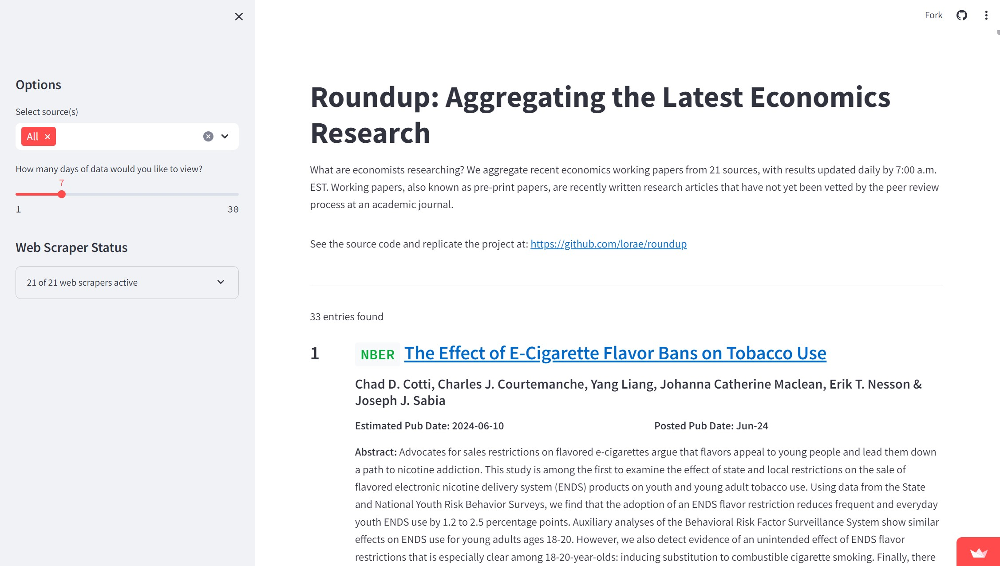

# The website is active!

View it here: https://roundup.streamlit.app/

[](https://roundup.streamlit.app/)

# About

The purpose of this project is regularly track and present the most economics research on an [interactive, sortable feed](https://roundup.streamlit.app/). We do so by web scraping research daily from academic organizations' websites. The data we collect are titles, authors, summaries, and links of *working papers* (also known as *pre-print papers*), which present academic research that has not yet been vetted by the peer review process. The dashboard may be of use for those interested in understanding the most recent active areas of economics research, such as economists, policy-oriented researchers, and students.

Remotely run via GitHub Actions once daily, this project scrapes data from working paper publishers at 6:40 AM EST, compares newly collected data to a historic record of working papers, and presents the results on an interactive [website](https://roundup.streamlit.app/).  As of June 2024, the project incorporates data from 21 different sources.

# How it works

The primary purpose of this repository is to maintain and improve the [project dashboard](https://roundup.streamlit.app/). A detailed summary of the web scraping, GitHub Actions, and Streamlit components of this project follow.

### Web scraping

The web scrapers in this project gather eight pieces of information on each economics working paper:
- **Title**
- **Author(s)**
- **Abstract**: A one-paragraph long summary of the paper.
- **Date published**: As reported by the website of origin. If the paper was posted and re-posted, the most recent date of publication is used.
- **estPubDate**: Our best estimate for when the paper was posted. We define it as the first date that the paper was encountered by our web scrapers. Sometimes this may differ from the official publication date by a few days.
- **URL**: URLs to working paper landing pages, rather than direct links to PDFs, are preferred. However, with some sources, this is not possible, and PDF URLs are provided instead.
- **Paper ID number**: According to each website's own numbering system. This information is crucial for uniquely identifying working papers that have been previously encountered by our web scrapers versus those that are novel.
- **Source**: Name of the website where the paper was published.

A variety of methods are used to access web-based data, including PDF rendering, direct requests to hidden APIs, use of Selenium to read Java-rendered content, HTML parsing, and more. A high-level summary of the methods used to scrape each website can be found in the [Data Sources](#data-sources) section of this document.

This project is maintained in an object-oriented format. Each website has a bespoke method, called `fetch_data()`, designed to scrape it and defined in a website-specific class located in `src/scraper/sites`. To impose order on the 20+ web scrapers involved in this project, each website-specific scraper class is a child of the `GenericScraper` abstract base class, defined in `src/scraper/generic_scraper.py`.

All websites can be scraped by running the `run_scraper.py` script, located in the root directory. It instantiates each scraper class sequentially and saves the collected data in uniformly-structured Pandas data frames. It also records whether the scrape was successful or unsuccessful in `streamlit/scraper_status.txt`. This list of scraped data frames is then combined into one resultant data frame of all scraped working paper entries in a given run.

The data frame of web scrape results is then passed to various methods in the `HistoricDataComparer` class from `src/scraper/data_comparer.py`. These methods identify novel (versus previously encountered) data by comparing the newly-scraped paper identifiers to old identifiers. All those that are truly novel are assigned an estimated publication date of the day that they were first identified, and appended to the `data/historic-wp-data.csv` and `data/historic-wp-ids.txt` files, which are used in identifying and maintaining a record of data encountered so far. 

### GitHub Actions automated workflow

The web scraping activity in this repository is run on the cloud and fully automated through a GitHub Actions project workflow. When `.github/workflows/main.yml` is activated at 6:40 AM Eastern Standard Time every day, it runs the main script of the project - `run_scraper.py` - which cycles through each of the web scraping modules, and then through data comparison modules that identify and store newly-encountered data. The project workflow concludes by committing its changes to `data/historic-wp-data.csv` and `data/historic-wp-ids.txt` under the alias `actions-user`. These commits are given the description, "run (DD/MM/YYYY)", with "DD/MM/YYYY" populated by the day, month, and year the action was initiated.

### Streamlit dashboard

The `streamlit_app.py` script produces the [project website](https://roundup.streamlit.app/), which is a user-friendly, interactive aggregation of the most recent economics research. The app draws primarily from the `data/historic-wp-data.csv` file to populate itself with information. Streamlit automatically refreshes its data display roughly every five minutes. Thus, within five minutes of a daily commit made by GitHub Actions, changes to `data/historic-wp-data.csv` should be reflected on the website. The app also references `streamlit/scraper_status.txt` to indicate the status of each scraper. A scraper is marked as "inactive" if an error occurred during its most recent run.

GitHub Actions are initiated at 6:40 AM EST and typically take between four and six minutes to run. With an additional five minutes of time built in for Streamlit to update, all newly scraped information should be reflected on the project dashboard by 7:00 AM EST daily.


# Data sources
Websites that are scraped for data, as of June 2024, are:

| Name of website                                                  | Name of script                          | Scraping method |
|------------------------------------------------------------------|-----------------------------------------|-----------------|
| [Bureau of Economic Analysis](https://www.bea.gov/research/papers)                                      | src/scraper/sites/bea_scraper.py         | Sends a GET request to the source's main page and parses the response using BeautifulSoup. A secondary GET request is made to each working paper's landing page and parsed using BeautifulSoup.           |
| [Becker Friedman Institute](https://www.bea.gov/research/papers) (at the University of Chicago)       | src/scraper/sites/bfi_scraper.py         |         Sends a GET request to the source's main page and parses the response using BeautifulSoup. A secondary GET request is made to each working paper's landing page and parsed using BeautifulSoup.         |
| [Bank for International Settlements](https://www.bis.org/doclist/wppubls.rss?from=&till=&objid=wppubls&page=&paging_length=10&sort_list=date_desc&theme=wppubls&ml=false&mlurl=&emptylisttext=)                                | src/scraper/sites/bis_scraper.py         |   Requests and parses the source's main RSS feed using feedparser.     |
| [Bank of England](https://www.bankofengland.co.uk/rss/publications)                                                  | src/scraper/sites/boe_scraper.py         |         Requests and parses the source's main RSS feed using feedparser. A secondary GET request is made to each working paper's landing page and parsed using BeautifulSoup.           |
| [European Central Bank](https://www.ecb.europa.eu/pub/research/working-papers/html/index.en.html)                                            | src/scraper/sites/ecb_scraper.py         |  Uses Selenium to access the source's main page and parses the output using BeautifulSoup. 
| [Federal Reserve Bank of Atlanta](https://www.atlantafed.org/rss/wps)                                 | src/scraper/sites/fed_atlanta_scraper.py     | Requests and parses the source's main RSS feed using feedparser.            |
| [Federal Reserve Board of Governors](https://www.federalreserve.gov/econres/feds/index.htm) (of the United States): working papers | src/scraper/sites/fed_board_scraper.py       |         Sends a GET request to the source's main page and parses the response using BeautifulSoup.             |
| [Federal Reserve Board of Governors](https://www.federalreserve.gov/econres/notes/feds-notes/default.htm) (of the United States): Fed Notes | src/scraper/sites/fed_board_notes_scraper.py       | Sends GET requests to the source's main pages and parses the  responses using BeautifulSoup.              |
| [Federal Reserve Bank of Atlanta](https://www.atlantafed.org/rss/wps)                                      | src/scraper/sites/fed_atlanta_scraper.py         | Requests and parses the source's main RSS feed using feedparser.            |
| [Federal Reserve Bank of Boston](https://www.bostonfed.org/publications/research-department-working-paper/)                               | src/scraper/sites/fed_boston_scraper.py     | Sends a GET request to the source's API and parses the JSON-formatted response. A secondary GET request is made to each working paper's landing page and parsed using BeautifulSoup.       |
| [Federal Reserve Bank of Chicago](https://www.chicagofed.org/publications/publication-listing?filter_series=18)                                | src/scraper/sites/fed_chicago_scraper.py     | Sends a GET request to the source's main page and parses the response using BeautifulSoup. A secondary GET request is made to each working paper's landing page and parsed using BeautifulSoup.            |
| [Federal Reserve Bank of Cleveland](https://www.clevelandfed.org/publications/working-paper)                                 | src/scraper/sites/fed_cleveland_scraper.py     | Uses Selenium to access the source's main page and parses the output using BeautifulSoup.    |
| [Federal Reserve Bank of Dallas](https://www.dallasfed.org/research/papers)                                 | src/scraper/sites/fed_dallas_scraper.py     | Sends a GET request to the source's main page and parses the response using BeautifulSoup. A secondary GET request is used to access the working paper itself, with content parsed using made to each working paper's landing page and parsed using PyPDF2 and io.     |
| [Federal Reserve Bank of Kansas City](https://www.kansascityfed.org/research/research-working-papers/)                                 | src/scraper/sites/fed_kansas_city_scraper.py     | Sends a POST request to the source's API and parses the JSON response to get titles for each working paper entry. A secondary GET request is made to each working paper's landing page and parsed using BeautifulSoup.    |
| [Federal Reserve Bank of Minneapolis](https://www.minneapolisfed.org/economic-research/working-papers)                                      | src/scraper/sites/fed_minneapolis_scraper.py         | Sends a GET request to the source's main page and parses the response using BeautifulSoup. A secondary GET request is made to each working paper's landing page and parsed using BeautifulSoup.           |
| [Federal Reserve Bank of New York](https://www.newyorkfed.org/research/staff_reports/index.html)                                 | src/scraper/sites/fed_new_york_scraper.py     | Sends a GET request to the source's main page and parses the response using BeautifulSoup. Method also will send a similar GET request corresponding to the previous year's entries. A secondary GET request is made to each working paper's landing page and parsed using BeautifulSoup to extract working paper abstracts.            |
| [Federal Reserve Bank of Philadelphia](https://www.philadelphiafed.org/search-results/all-work?searchtype=working-papers)                               | src/scraper/sites/fed_philadelphia_scraper.py     | Sends a GET request to the source's main page and parses the response using BeautifulSoup and then as JSON data. A secondary GET request is made to each working paper's landing page and parsed using BeautifulSoup.       |
| [Federal Reserve Bank of Richmond](https://www.richmondfed.org/publications/research/working_papers)                               | src/scraper/sites/fed_richmond_scraper.py     | Sends a GET request to the source's main page and parses the response using BeautifulSoup. A secondary GET request is made to each working paper's landing page and parsed using BeautifulSoup.      |
| [Federal Reserve Bank of San Francisco](https://www.frbsf.org/economic-research/publications/working-papers/)                                | src/scraper/sites/fed_san_francisco_scraper.py     | Sends a GET request to the source's API and collects data from the JSON response. If data for certain entries are missing, the working paper's landing page is requested and the HTML response is parsed using BeautifulSoup.    |
| [Federal Reserve Bank of St. Louis](https://research.stlouisfed.org/wp)                                | src/scraper/sites/fed_st_louis_scraper.py     | Sends a GET request to the source's main page and parses the response using BeautifulSoup.    |
| [International Monetary Fund](https://www.imf.org/en/Publications/RSS?language=eng&series=IMF%20Working%20Papers)                                      | src/scraper/sites/imf_scraper.py         | Sends a GET request to the source's main page and parses the response using BeautifulSoup. A secondary GET request is made to each working paper's landing page and parsed using BeautifulSoup.            |
| [National Bureau of Economic Research](https://www.nber.org/api/v1/working_page_listing/contentType/working_paper/_/_/search?page=1&perPage=100)                             | src/scraper/sites/nber_scraper.py        | Sends a GET request to the source's API and parses the JSON response. A secondary GET request is made to each working paper's landing page and parsed using BeautifulSoup.  |


# Getting started

The web scrapers are run remotely at 6:40 AM EST daily via the project GitHub Actions workflow located in `.github/workflows/main.yml`. No additional action is required to initiate this process.

However, the web scrapers may also be operated on your local machine. This may be useful for debugging purposes or for cloning the project for your own usage. See below for instructions on how to run the project [for the first time](#if-running-a-local-instance-for-the-first-time) on your local machine and [any subsequent time](#if-running-a-local-instance-again).

### If running a local instance for the first time:

1. **Clone the repository:**
   ```sh
   git clone https://github.com/lorae/roundup
   ```

2. **Set your working directory in the repository:**
   ```sh
   cd your/path/to/roundup
   ```

3. **Create a [virtual environment](https://docs.python.org/3/library/venv.html):**
   ```sh
   python -m venv .venv
   ```

4. **[Source](https://docs.python.org/3/library/venv.html#how-venvs-work) the virtual environment:**

    - **Using bash/zsh:**
      ```sh
      source .venv/bin/activate
      ```

    - **Using Windows PowerShell:**
      ```sh
      .venv/Scripts/activate
      ```

5. **Install dependencies**
   ```sh
   python -m pip install -r requirements.txt
   ```

6. **Start the script**
    ```sh
    python run_scraper.py
    ```

7. **View results:**

    Local unique results will be stored in `data/local_scrape_outcomes`. Three files are created with each run:

    - `YYYY-MM-DD-HHMM-data.csv`: Contains all novel working paper entries with metadata.

    - `YYYY-MM-DD-HHMM-dashboard.html`: Browser-viewable dashboard file with clickable links for each entry.

    - `YYYY-MM-DD-HHMM-ids.txt`: Unique identifiers of the novel entries, formatted as a Python set.
    
    Note that "YYYY-MM-DD-HHMM" will be populated with the day, hour and minute that you instantiated the HistoricDataComparer class, which contains the `save_results` method that produces these files.

    Results will also be appended to `data/historic-wp-data.csv` and `data/historic-wp-ids.txt` with each run of `run_scraper.py`. However, these files are more difficult to comfortably view directly, as they contain *all* working papers *ever encountered* by the web scrapers.

    Note that the results in `data/local_scrape_outcomes/` are local only, and ignored by GitHub (`.gitignore`). The interactive project dashboard on [https://roundup.streamlit.app](https://roundup.streamlit.app/) will not be updated with results from your local run unless you commit your changes to `data/historic-wp-data.csv` to the `main` branch of the repository.

### If running a local instance again:
1. **Set your working directory into the repository:**
   ```sh
   cd your/path/to/roundup
   ```

2. **[Source](https://docs.python.org/3/library/venv.html#how-venvs-work) the virtual environment:**

    - **Using bash/zsh:**
      ```sh
      source .venv/bin/activate
      ```

    - **Using Windows PowerShell:**
      ```sh
      .venv/Scripts/activate
      ```
      
3. **Start the script**
   ```sh
   python run_scraper.py
   ```

4. **View results:**

    As above.

# Project file structure
```
roundup/
│
├── .gitignore
├── README.md # The file you are currently reading
├── run_scraper.py # Main project script
├── requirements.txt # Project dependencies
│
├── src/
│ ├── data_comparer.py # Defines `HistoricDataComparer` class for data comparison and saving
│ └── scraper/ # Web scraping modules
│   ├── generic_scraper.py # Defines `GenericScraper` class
│   ├── external_requests.py # Methods for accessing and parsing remote data
│   └── sites/ # Website-specific scraping modules
|     ├── bea_scraper.py
|     ├── bfi_scraper.py
|     ├── bis_scraper.py
|     ├── boe_scraper.py
|     ├── ecb_scraper.py
|     └── ...
│
├── data/
│ ├── wp_ids.txt # Set of unique IDs for previously encountered data
│ ├── wp_data.csv # Table of previously encountered data
│ └── local_scrape_outcomes/ # Holds results of local scrapes
│   ├── README.md # Explains purpose and usage of the local scrape outcome directory
│   ├── YYYY-MM-DD-HHMM-dashboard.html
│   ├── YYYY-MM-DD-HHMM-data.csv
│   ├── YYYY-MM-DD-HHMM-ids.txt
│   └── ...
│
├──.github/workflows/
│ └── main.yml # Defines `Daily Run` GitHub Actions workflow
│
└── streamlit
  ├── app.py # Creates Streamlit website
  └── scraper_status.txt # Tracks active and inactive web scrapers

```

# Web scraping disclaimer

This code accesses remote data via network requests. The scripts are programmed to make minimal and spaced-out requests to avoid putting undue load on the servers of the data sources. Our goal is to collect data responsibly. The collected data is intended for academic and research purposes only.

All efforts have been made to ensure that the scraping activities comply with the terms of service and `robots.txt` directives of the websites from which data is being collected. However, terms of service can change, and it is the sole responsibility of users of this code to ensure ongoing compliance.  The developers of this project accept no liability for any misuse of the data or any damages that might arise from the use of this code.

By using this code, you agree to abide by these principles and to regularly check the terms of service of the websites you are scraping to ensure compliance.
